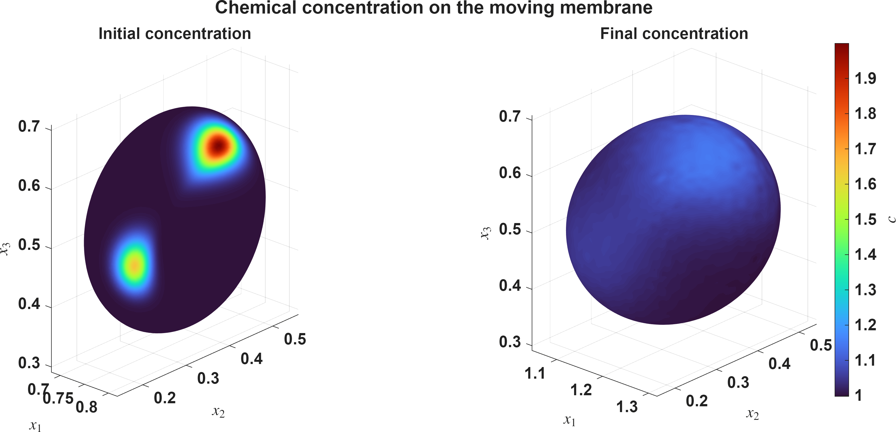

# kernelpack-matlab

`kernelpack-matlab` is an open-source MATLAB toolkit for meshfree geometry,
node generation, radial basis function finite differences (RBF-FD), partition
of unity (PU) methods, and partial differential equations on domains and
surfaces. Its interfaces follow the numerical organization of
[KernelPack](https://github.com/VarShankar/kernelpack) while remaining
MATLAB-native and easy to inspect.

## Capabilities

- Smooth and piecewise-smooth embedded curves and surfaces
- Fixed-radius Poisson node generation with geometry-aware clipping
- Legendre polynomial bases and dimension-generic multi-index utilities
- Standard and overlapped PHS+poly RBF-FD assembly
- Fixed-domain Poisson, variable-coefficient Poisson, and BDF diffusion
- PU diffusion for scalar and multispecies systems
- Divergence-free PHS+poly interpolation
- Tangent-plane RBF-FD operators on stationary and moving surfaces
- Lagrangian moving-surface advection-diffusion-reaction solvers
- Defect-corrected differentiation-matrix updates and adaptive hyperviscosity
- Geometry-derived quadrature, mass correction, marker rearrangement, and
  semi-Lagrangian history backfill on moving surfaces
- Mean-curvature-flow evolution and IBAMR trajectory reconstruction

The primary packages are `kp.geometry`, `kp.nodes`, `kp.domain`, `kp.poly`,
`kp.rbffd`, `kp.manifold`, and `kp.solvers`.

## Requirements

- MATLAB R2022b or newer
- Statistics and Machine Learning Toolbox for the KD-tree searches used by
  divergence-free interpolation and surface workflows
- Parallel Computing Toolbox is optional; supported assembly routines fall
  back to serial execution when it is unavailable
- `export_fig` is optional and used only for publication-style figure export

The core package has no third-party MATLAB runtime dependencies. The optional
three-dimensional membrane example uses externally generated IBAMR data.

## Installation

Clone the repository and add its root to the MATLAB path:

```matlab
addpath('path/to/kernelpack-matlab');
```

The repository is also a [MIP](https://mip.sh/) package:

```matlab
eval(webread('https://mip.sh/install.txt'))
mip install https://github.com/VarShankar/kernelpack-matlab
mip load kernelpack_matlab
mip test kernelpack_matlab
```

## Quick Start

The following example solves a Poisson problem on a sampled disk:

```matlab
t = linspace(0, 2*pi, 201).';
t(end) = [];

surface = kp.geometry.EmbeddedSurface();
surface.setDataSites([cos(t), sin(t)]);
surface.buildClosedGeometricModelPS(2, 0.08, numel(t));
surface.buildLevelSetFromGeometricModel([]);

generator = kp.nodes.DomainNodeGenerator();
domain = generator.buildDomainDescriptorFromGeometry(surface, 0.08, ...
    'Seed', 17, 'StripCount', 5);

solver = kp.solvers.PoissonSolver( ...
    'LapAssembler', 'fd', 'BCAssembler', 'fd', ...
    'LapStencil', 'rbf', 'BCStencil', 'rbf');
solver.init(domain, 4);

uExact = @(X) 1 - sum(X.^2, 2);
result = solver.solve( ...
    @(X) 4 * ones(size(X, 1), 1), ...
    @(X) zeros(size(X, 1), 1), ...
    @(X) ones(size(X, 1), 1), ...
    @(NeuCoeffs, DirCoeffs, nr, Xb) uExact(Xb));
```

See [`examples`](examples) for complete convergence studies and solver
workflows.

## Moving Surfaces

The manifold package implements tangent-plane PHS+poly RBF-FD discretizations
for stationary and evolving surfaces. The moving-surface ADR driver includes
the complete Lagrangian-Eulerian method used in the accompanying research:

```matlab
results = moving_surface_adr_tp_convergence_study();
```

Representative studies include:

- [`stationary_surface_adr_tp_convergence_study.m`](examples/stationary_surface_adr_tp_convergence_study.m)
- [`stationary_ellipsoid_surface_adr_tp_convergence_study.m`](examples/stationary_ellipsoid_surface_adr_tp_convergence_study.m)
- [`moving_surface_adr_tp_convergence_study.m`](examples/moving_surface_adr_tp_convergence_study.m)
- [`moving_surface_adr_tp_geometric_flow_suite.m`](examples/moving_surface_adr_tp_geometric_flow_suite.m)
- [`moving_surface_adr_tp_spheroid_rearrangement_study.m`](examples/moving_surface_adr_tp_spheroid_rearrangement_study.m)
- [`moving_surface_adr_tp_rbc_capstone.m`](examples/moving_surface_adr_tp_rbc_capstone.m)



### RBC capstone data

The full IBAMR trajectory and saved MATLAB capstone result are distributed as
the `data-v1` release asset rather than inside the installable package. Download
and verify them from MATLAB with:

```matlab
download_rbc_capstone_data
```

The companion IBAMR application and all parameters required to regenerate the
trajectory are retained in [`examples/ibamr_rbc_3d`](examples/ibamr_rbc_3d).

## Tests

Run the public verification suite from the repository root:

```matlab
addpath(pwd);
addpath(fullfile(pwd, 'tests'));
run_public_checks;
```

The data-dependent RBC checks are run separately after downloading the release
asset:

```matlab
ibamr_surface_trajectory_checks;
moving_surface_rbc_capstone_checks;
```

## Citation

Citation metadata are provided in [`CITATION.cff`](CITATION.cff). Please cite
the associated numerical-method paper when using the moving-surface solver in
published work; its final bibliographic record will be added after publication.

## License

The source code is available under the
[BSD 3-Clause License](LICENSE). This permissive license allows academic and
commercial use, modification, and redistribution subject to its terms.
