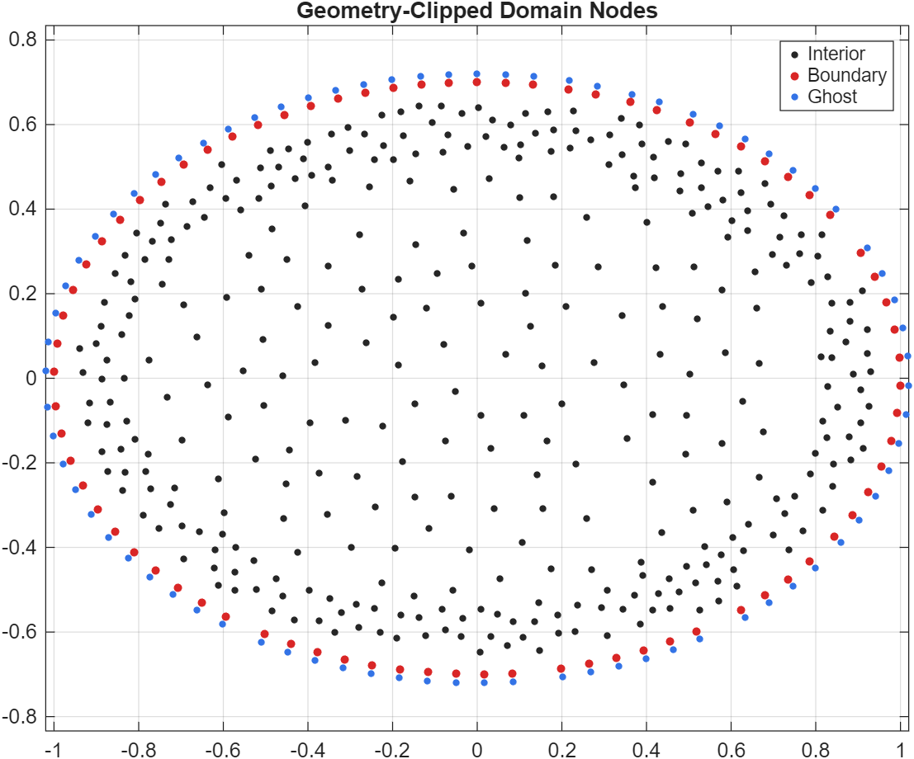

# kernelpack-matlab

[](https://github.com/VarShankar/kernelpack-matlab/actions/workflows/matlab.yml)
[](https://github.com/VarShankar/kernelpack-matlab/releases/latest)
[](LICENSE)
[](#requirements)

**Meshfree geometry, RBF-FD, partition-of-unity methods, and PDE solvers for
MATLAB.**

`kernelpack-matlab` provides MATLAB implementations of meshfree geometry,
scattered-node discretizations, and PDE solvers on fixed domains and surfaces.
The public release includes both reusable package classes and the research
drivers used for prescribed moving-surface ADR studies.


[Install](#installation) | [First solve](#first-solve) |
[Moving surfaces](#moving-surface-pdes) | [Examples](#examples) |
[Tests](#verification) | [Citation](#citation)

## At a glance

| Component | What the public release provides |
| --- | --- |
| Geometry models | Embedded and piecewise-smooth implicit surfaces, RBF level sets, periodic two-parameter SBF surface fits, and PCA or cached global SBF normal estimation for sphere- and torus-homeomorphic surfaces |
| Node generation | Fixed- and variable-radius Poisson sampling in boxes, clipping by embedded geometry, boundary and ghost nodes, boundary-zone outer refinement, and dual node sets |
| Local approximation | Legendre polynomial bases, standard and overlapped PHS+poly RBF-FD, weighted-least-squares stencils, tangent-plane surface operators, and local divergence-free PHS interpolation |
| Fixed-domain solvers | Poisson, variable-coefficient Poisson, BDF1--BDF3 diffusion, localized PU diffusion, and multispecies PU diffusion |
| Prescribed surface ADR | A Lagrangian BDF1--BDF3 research driver for advection-diffusion-reaction equations on stationary or prescribed moving surfaces |
| Surface updates and remapping | Direct or defect-corrected tangent-plane matrix updates, surface hyperviscosity, geometry-supplied quadrature and mass correction, quality-triggered marker rearrangement, local tangent-plane or SBF transfer, and semi-Lagrangian BDF-history backfill |
| Surface evolution and trajectory data | Tangent-plane RBF-FD mean-curvature flow and an SBF-based interpolator for externally generated, sphere-homeomorphic IBAMR material trajectories |

`kp.geometry.triangulateClosedSurface` is included as a plotting helper; its
triangulation is not used to assemble the meshfree PDE operators.
`kp.solvers.MeshfreeGeometricMultilevelSolver` currently preserves the MGM
configuration interface only; the executable hierarchy and V-cycle are not
part of this public release.

The main namespaces are `kp.geometry`, `kp.nodes`, `kp.domain`, `kp.poly`,
`kp.rbffd`, `kp.manifold`, `kp.divfree`, and `kp.solvers`.

## Requirements

- MATLAB R2022b or newer
- Statistics and Machine Learning Toolbox for KD-tree searches
- Parallel Computing Toolbox is optional; parallel-capable assembly routines
  fall back to serial execution when it is unavailable
- `export_fig` is optional and needed only by publication-figure scripts

The package has no required third-party MATLAB runtime dependency. The
three-dimensional membrane example uses an optional, separately distributed
IBAMR trajectory dataset.

## Installation

### Clone the repository

```bash
git clone https://github.com/VarShankar/kernelpack-matlab.git
```

Add the repository root to the MATLAB path:

```matlab
addpath('path/to/kernelpack-matlab')
```

### Install with MIP

`kernelpack-matlab` is also distributed as a [MIP](https://mip.sh/) package:

```matlab
eval(webread('https://mip.sh/install.txt'))
mip install https://github.com/VarShankar/kernelpack-matlab
mip load kernelpack_matlab
mip test kernelpack_matlab
```

## First solve

This example constructs a disk from boundary samples, generates interior and
ghost nodes, solves $-\Delta u = 4$ with $u = 0$ on the boundary, and plots
the numerical solution.

```matlab
t = linspace(0, 2*pi, 201).';
t(end) = [];

surface = kp.geometry.EmbeddedSurface();
surface.setDataSites([cos(t), sin(t)]);
surface.buildClosedGeometricModelPS(2, 0.08, numel(t));
surface.buildLevelSetFromGeometricModel([]);

generator = kp.nodes.DomainNodeGenerator();
domain = generator.buildDomainDescriptorFromGeometry(surface, 0.08, ...
    'Seed', 17, 'StripCount', 5);

solver = kp.solvers.PoissonSolver( ...
    'LapAssembler', 'fd', 'BCAssembler', 'fd', ...
    'LapStencil', 'rbf', 'BCStencil', 'rbf');
solver.init(domain, 4);

forcing = @(X) 4 * ones(size(X, 1), 1);
dirichlet = @(X) ones(size(X, 1), 1);
neumann = @(X) zeros(size(X, 1), 1);
boundaryData = @(neuCoeff, dirCoeff, normals, X) ...
    zeros(size(X, 1), 1);
result = solver.solve(forcing, neumann, dirichlet, boundaryData);

X = domain.getIntBdryNodes();
tri = delaunay(X(:, 1), X(:, 2));
trisurf(tri, X(:, 1), X(:, 2), result.u, result.u);
shading interp;
view(2);
axis equal tight;
colorbar;
title('Poisson solution');
```



## Moving-surface PDEs

The manifold implementation builds PHS+poly RBF-FD operators in local tangent
planes. The moving-surface ADR solver combines Lagrangian marker motion with
implicit time stepping, updated surface differential operators,
hyperviscosity, geometry-based quadrature and mass correction, and
semi-Lagrangian backfill after marker rearrangement.

Run the primary manufactured convergence study with:

```matlab
results = moving_surface_adr_tp_convergence_study();
```

The public examples include stationary and evolving spheres, ellipsoids,
tori, geometric flows, marker-rearrangement studies, literature comparisons,
and transport on a fluid-driven biconcave membrane.

## Examples

All complete workflows live in [`examples`](examples). Useful starting points
are:

| Goal | Example |
| --- | --- |
| Solve Poisson's equation on an embedded domain | [`poisson_solver_example.m`](examples/poisson_solver_example.m) |
| Solve a variable-coefficient elliptic problem | [`variable_poisson_solver_example.m`](examples/variable_poisson_solver_example.m) |
| Advance a diffusion problem | [`diffusion_solver_example.m`](examples/diffusion_solver_example.m) |
| Build a divergence-free interpolant | [`divfree_interp_example.m`](examples/divfree_interp_example.m) |
| Verify stationary-surface ADR convergence | [`stationary_surface_adr_tp_convergence_study.m`](examples/stationary_surface_adr_tp_convergence_study.m) |
| Verify moving-surface ADR convergence | [`moving_surface_adr_tp_convergence_study.m`](examples/moving_surface_adr_tp_convergence_study.m) |
| Evolve a surface by mean curvature | [`mean_curvature_flow_ellipsoid_example.m`](examples/mean_curvature_flow_ellipsoid_example.m) |
| Study marker rearrangement and history backfill | [`moving_surface_adr_tp_spheroid_rearrangement_study.m`](examples/moving_surface_adr_tp_spheroid_rearrangement_study.m) |
| Reproduce the biconcave-membrane transport case | [`moving_surface_adr_tp_rbc_capstone.m`](examples/moving_surface_adr_tp_rbc_capstone.m) |

## Membrane capstone data

The IBAMR trajectory and saved MATLAB capstone result are distributed in the
[`data-v1` release](https://github.com/VarShankar/kernelpack-matlab/releases/tag/data-v1)
rather than in the installable source package. Download and verify the archive
from MATLAB:

```matlab
download_rbc_capstone_data
```

The companion IBAMR application and its reproducibility parameters are in
[`examples/ibamr_rbc_3d`](examples/ibamr_rbc_3d).

## Verification

Run the public verification suite from the repository root:

```matlab
addpath(pwd);
addpath(fullfile(pwd, 'tests'));
run_public_checks;
```

After downloading the optional membrane data, run its checks separately:

```matlab
ibamr_surface_trajectory_checks;
moving_surface_rbc_capstone_checks;
```

The same public suite runs in GitHub Actions on every push and pull request.

## Citation

Citation metadata are provided in [`CITATION.cff`](CITATION.cff). If you use
the moving-surface solver in published work, please also cite the associated
numerical-method paper; its final bibliographic record will be added after
publication.

## Contributing

Bug reports, focused pull requests, and reproducible numerical examples are
welcome. See [`CONTRIBUTING.md`](CONTRIBUTING.md) for the development workflow
and [`SECURITY.md`](SECURITY.md) for responsible vulnerability reporting.

## License

`kernelpack-matlab` is released under the [BSD 3-Clause License](LICENSE),
which permits academic and commercial use, modification, and redistribution
subject to its terms.
